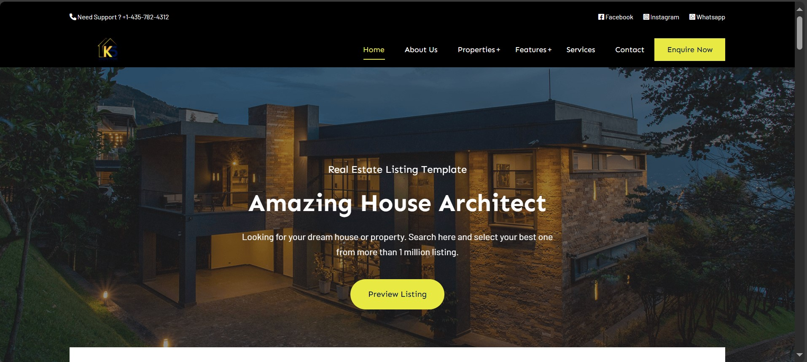

# Real Estate Full-Stack Dynamic Website

## Screenshot


## Overview
This is a full-stack dynamic real estate website with an admin panel that allows clients to manage UI content. The platform enables users to browse property listings, and administrators can update content dynamically through the admin dashboard.

## Features
### User Features:
- Browse property listings with images and details
- Search and filter properties by category, location, and price
- Contact sellers or inquire about properties
- User authentication (login/register)

### Admin Panel Features:
- Manage property listings (add, edit, delete)
- Update UI content dynamically (text, images, sections)
- Manage users and inquiries
- Secure login for admin access

## Installation Guide
1. Clone the repository:
   ```sh
   git clone https://github.com/yourusername/realestate-website.git
   ```
2. Navigate to the project folder:
   ```sh
   cd realestate-website
   ```
3. Install dependencies (if using Node.js):
   ```sh
   npm install
   ```
4. Configure the database:
   - Import `database.sql` to MySQL
   - Update `.env` file with database credentials
5. Start the server:
   ```sh
   php -S localhost:8000 -t public (for PHP projects)
   OR
   npm start (for Node.js projects)
   ```
6. Access the website at `http://localhost:8000`


## License
This project is licensed under the MIT License.


